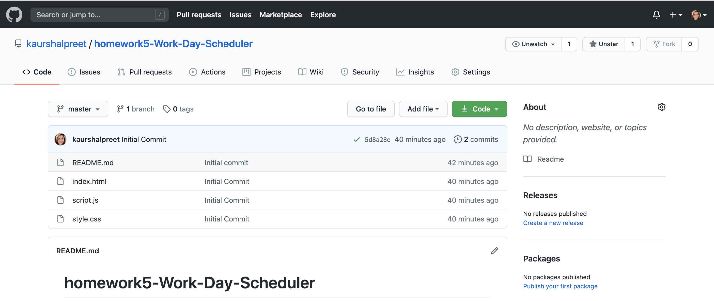
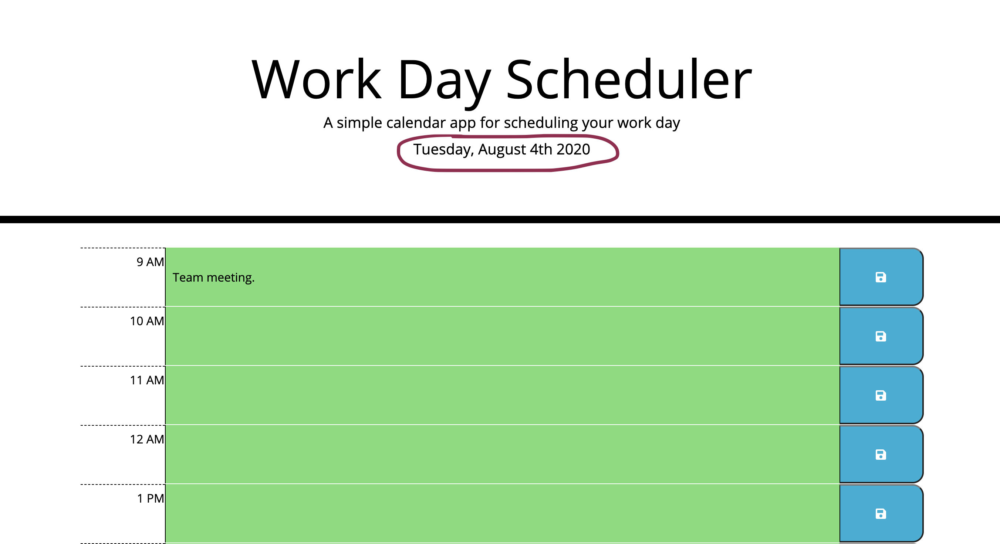

# homework5-Work-Day-Scheduler

## Description
 This project is a simple calendar application that allows the user to save events for each working hour of the day. This app will run in the browser and feature dynamically updated HTML and CSS powered by jQuery. I have learnt some new cool things in the process of working on this project like using the [Moment.js](https://momentjs.com/) library to work with date and time.

 [The project can be accessed at my github repository](https://github.com/kaurshalpreet/homework5-Work-Day-Scheduler)
 

 ---

# Table of Contents
1. Getting Started
1. Running the application
1. Credits
---

## Getting Started

This project is a daily planner application that allows you to save events for each working hour of your day. The saved events will be stored in the local storage of your machine. 

---

## Running the Application

[The Daily Planner page can be accessed via github page here](https://kaurshalpreet.github.io/homework5-Work-Day-Scheduler/)

You can use this daily planner to create a schedule. When you go to the Daily Planner page, the current day is displayed at the top of the calendar as marked in an image below.

---

When you scroll down you are presented with timeblocks for standard business hours

---

Each timeblock is color coded to indicate whether it is in the past, present, or future. Grey color represents past hour(s), Red color represents present hour and Green color represents future hour(s).

---

When you click into a timeblock, you can enter an event. 

---

When you click the save button for that timeblock, the text for that event is saved in local storage 

---

The saved events persist on refreshing the page.

---

## Credits
* UC Davis BootCamp-Instructor & TAs!
* https://momentjs.com/
* https://www.w3schools.com/
* https://www.google.com/
* https://www.youtube.com/

 
